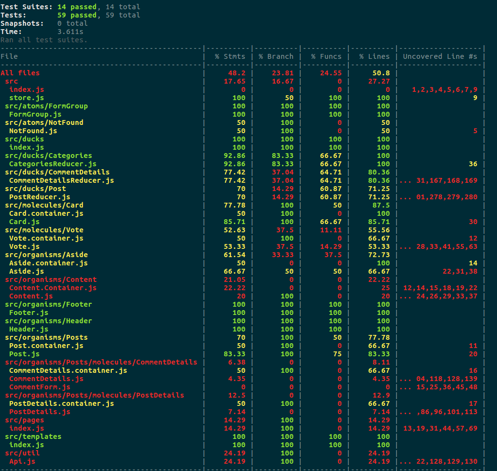

Projeto do nanoDegre da Udacity
## How to initialize the application
To install and start the API server, see the read me inside api-server directory:

After:
  - npm install
  - npm start

## Run tests
- npm test

## run coverage
- npm run coverage

## Structure of the project
```bash
├── README.md - This file.
├── .editorconfig
├── .eslintrc
├── .gitignore
├── package.json # npm package manager file.
├── coverage
│   ├── lcov-report
│   └── clover.xml
│   └── coverage-final.json
│   └── lcov.info
├── public
│   ├── favicon.ico # React Icon, You may change if you wish.
│   └── index.html
│   └── manifest.json
├── scripts
│   ├── build.js
│   └── start.js
│   └── test.js
└── src
    ├── atoms
    │   ├── FormGroup
    │   └── NotFound
    ├── ducks
    │   ├── Categories
    │   └── CommentDetails
    │   └── Post
    │   └── index
    ├── molecules
    │   ├── Card
    │   ├── Vote
    ├── organisms
    │   ├── Aside
    │   └── Content
    │   └── Footer
    │   └── Header
    │   └── Posts
    │       ├── molecules
    │       │   └── CommentDetails
    │       │   └── PostDetails
    │       └── Post.container
    │       └── Post

    ├── pages
    │   ├── index.js
    │   └── index.test.js
    ├── templates
    │   ├── index.js
    │   └── template.css
    │   └── template.test.js
    ├── util
    │   ├── Api.js
    ├── index.css # Global styles. You probably won't need to change anything here.
    ├── logo.svg
    └── index.js # You should not need to modify this file. It is used for DOM rendering only.
```

## Coverage

